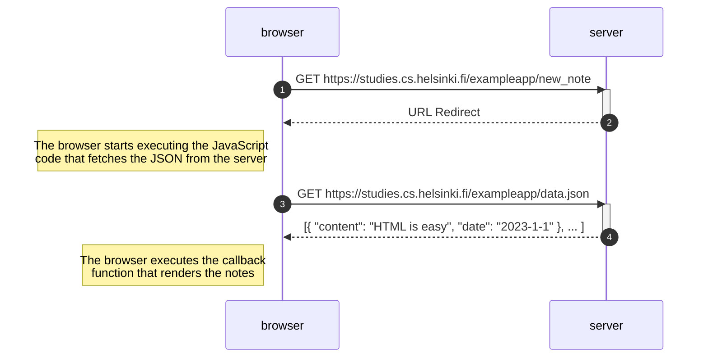

```mermaid
  sequenceDiagram
    autonumber
    participant browser
    participant server

    browser->>server: GET https://studies.cs.helsinki.fi/exampleapp/new_note
    activate server
    server-->>browser: URL Redirect
    deactivate server

    note left of browser: The browser starts executing the JavaScript<br/>code that fetches the JSON from the server

    browser->>server: GET https://studies.cs.helsinki.fi/exampleapp/data.json
    activate server
    server-->>browser: [{ "content": "HTML is easy", "date": "2023-1-1" }, ... ]
    deactivate server

    note left of browser: The browser executes the callback<br/>function that renders the notes
```
