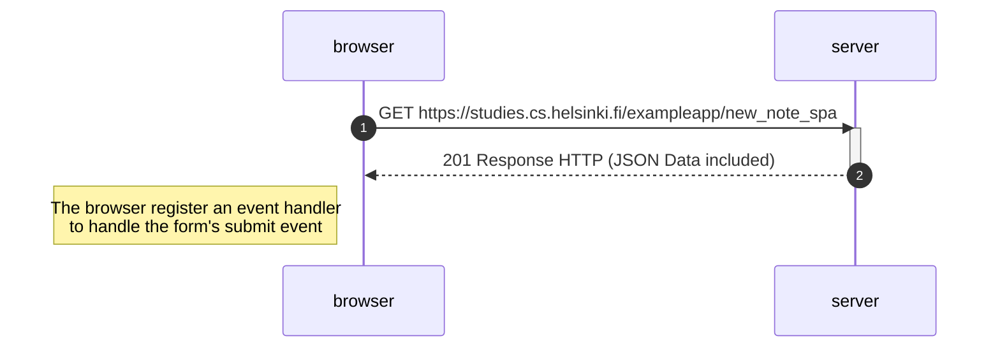

```mermaid
  sequenceDiagram
    autonumber
    participant browser
    participant server

    browser->>server: GET https://studies.cs.helsinki.fi/exampleapp/new_note_spa
    activate server
    server-->>browser: 201 Response HTTP (JSON Data included)
    deactivate server

    note left of browser: The browser register an event handler<br/>to handle the form's submit event

```
